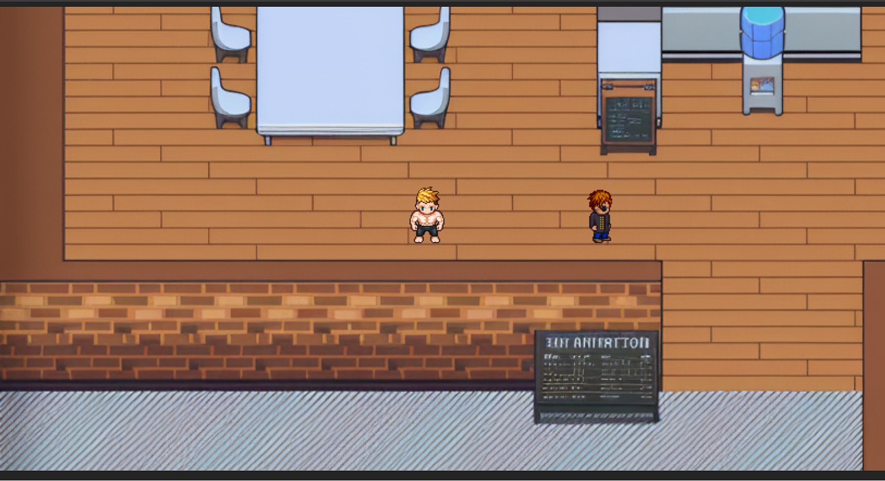
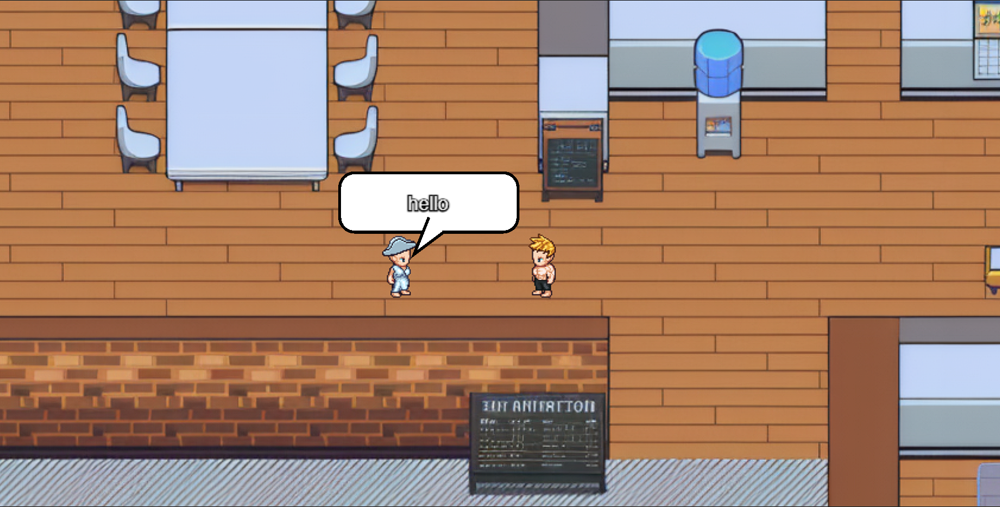

# Meta‑Collab 🚀

A **real‑time multiplayer collaboration / metaverse platform** built as a **production‑ready monorepo**.
Meta‑Collab focuses on **low‑latency real‑time interaction**, scalable backend services, and modern DevOps practices.

---

## 🧠 What is Meta‑Collab?

Meta‑Collab is a WebSocket‑heavy real‑time application where multiple users can:

- Join shared virtual rooms
- Move avatars in real time
- Interact with other users instantly
- Maintain persistent state using a database

The project is designed to **simulate real‑world system design challenges** such as:

- Real‑time networking
- State synchronization
- Backend scalability
- Monorepo architecture
- Dockerized deployment

---

## 🖼️ Screenshots / Demo

### Lobby / Room View

<p align="center">
  
</p>

### Multiple Avatars Interaction

<p align="center">
  
</p>

### Real-time Movement / Chat

<p align="center">
  
</p>
---

## 🏗️ Architecture Overview

> _High‑level overview (diagram can be added later)_

```
Frontend (React + PixiJS)
        |
        | HTTP (REST)
        v
   HTTP Server (Express)
        |
        | WebSocket Events
        v
   WS Server (Socket / WS)
        |
        | Cache / Pub‑Sub
        v
   Database (PostgreSQL via Prisma)


┌────────────┐
│  PixiJS    │  ← Frontend (Canvas-based 2D rendering)
│  Frontend  │
└─────▲──────┘
      │ WebSocket (bi-directional)
      ▼
┌────────────┐
│ Node.js +  │  ← Real-time game server
│ Socket.io  │
└─────▲──────┘
      │
      └── PostgreSQL (persistent state)
           via Prisma ORM

```

---

## 📦 Monorepo Structure

```
project/
├── apps/
│   ├── pixi/        # React + PixiJS client
│   ├── http/            # REST API server
│   └── ws/              # WebSocket server
│
├── packages/
│   └── db/              # Prisma database client
│
├── pnpm-workspace.yaml
├── turbo.json
└── README.md
```

---

## 🛠️ Tech Stack

### Frontend

- React
- PixiJS
- TypeScript

### Backend

- Node.js
- Express
- WebSockets
- Prisma ORM
- PostgreSQL

### DevOps / Infra

- PNPM Workspaces
- Turborepo
- Docker & Docker Compose
- AWS EC2 (planned)
- Nginx (reverse proxy)

---

## 🚀 Getting Started (Local Development)

### 1️⃣ Prerequisites

- Node.js ≥ 18
- PNPM
- Docker (optional but recommended)

---

### 2️⃣ Install Dependencies

```bash
pnpm install
```

---

### 3️⃣ Environment Variables

Create environment files:

```bash
cp .env.example .env
cp .env.ws.example .env.ws
```

> ⚠️ Do not commit real secrets

---

### 4️⃣ Build Packages

```bash
pnpm --filter @repo/db build
pnpm --filter http build
pnpm --filter ws build
```

---

### 5️⃣ Start Services

```bash
pnpm --filter http start
pnpm --filter ws start
pnpm --filter frontend dev
```

---

## 🐳 Docker Setup

To run the entire stack using Docker:

```bash
docker compose build
docker compose up
```

This will start:

- Frontend
- HTTP API
- WebSocket server
- Database
- Redis

---

## 🌐 Deployment Strategy

### Recommended (Early Stage)

- **Frontend** → Vercel
- **HTTP + WS** → Single EC2 instance (Docker)
- **Nginx** → Reverse proxy for routing & SSL

### Why?

- Low cost
- Simple scaling
- Production‑like architecture

---

## 🧪 Testing (Planned)

- Unit tests for core logic
- Integration tests for APIs
- WebSocket event testing

---

## 📌 Roadmap

- [ ] Improve avatar movement reconciliation
- [ ] Add proximity chat
- [ ] Load testing WebSocket server
- [ ] CI/CD with GitHub Actions
- [ ] Kubernetes (optional)

---

## 🤝 Contributing

Contributions are welcome!

1. Fork the repo
2. Create a feature branch
3. Commit changes
4. Open a Pull Request

---

## 📄 License

MIT License

---

## 🙋 Author

**Himanshu Jaiswal**
Full‑Stack Developer | Real‑Time Systems Enthusiast

---

> ⭐ If you like this project, consider starring the repo!
